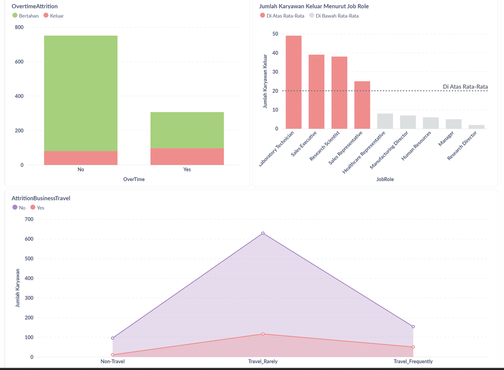

# Proyek Akhir: Menyelesaikan Permasalahan Perusahaan Edutech

## Business Understanding

Perusahaan multinasional Jaya Jaya Maju telah beroperasi sejak tahun 2000 dan kini memiliki lebih dari 1000 karyawan yang tersebar di berbagai wilayah Indonesia. Meski telah tumbuh menjadi perusahaan besar, Jaya Jaya Maju menghadapi tantangan serius dalam pengelolaan sumber daya manusia. Salah satu konsekuensinya adalah tingkat attrition yang tinggi, di mana lebih dari 10% karyawan memilih untuk meninggalkan perusahaan.

### Permasalahan Bisnis

Jaya Jaya Maju merupakan perusahaan multinasional yang telah beroperasi sejak tahun 2000 dan kini mempekerjakan lebih dari 1000 karyawan yang tersebar di berbagai wilayah Indonesia. Meskipun telah berkembang menjadi perusahaan berskala besar, Jaya Jaya Maju menghadapi tantangan serius dalam pengelolaan sumber daya manusia. Salah satu permasalahan utama yang muncul adalah tingginya tingkat attrition, di mana lebih dari 10% karyawan memilih untuk mengundurkan diri dari perusahaan.
Tingginya attrition rate ini menjadi indikator bahwa jumlah karyawan yang meninggalkan perusahaan secara sukarela jauh lebih tinggi dibandingkan dengan yang bertahan. Kondisi ini memberikan dampak signifikan terhadap stabilitas operasional, terutama karena kepergian karyawan dapat mengganggu alur kerja, menyebabkan keterlambatan dalam penyelesaian tugas, dan meningkatkan beban kerja bagi karyawan yang tersisa. Jika terus dibiarkan, situasi ini berpotensi menurunkan produktivitas secara keseluruhan dan memicu penurunan efisiensi dalam jangka panjang.
Untuk mengatasi tantangan ini, perusahaan perlu melakukan analisis menyeluruh terhadap faktor-faktor yang menyebabkan tingginya angka attrition. Faktor-faktor tersebut bisa berasal dari aspek internal perusahaan, seperti beban kerja yang tinggi, fasilitas kerja yang kurang memadai, serta rendahnya tingkat kepuasan dan keterlibatan karyawan. Di sisi lain, aspek eksternal seperti latar belakang pribadi karyawan juga dapat memengaruhi keputusan untuk keluar dari perusahaan. Dengan mengidentifikasi dan memantau faktor-faktor tersebut secara cermat, perusahaan dapat merancang strategi retensi yang lebih tepat sasaran, sehingga mampu menekan tingkat attrition dan menjaga keberlanjutan operasional secara optimal.

### Cakupan Proyek

- Preprocessing data untuk memperoleh data yang clean hingga dapat dianalisis.
- Analisis berupa Eksplorasi Data dengan memperoleh faktor yang mempengaruhi Attrition Rates meningkat di perusahaan
- Membuat Dashboard yang menunjukkan nilai Attrition Rates berdasarkan data pegawai.
- Mengembangkan model machine learning untuk mengidentifikasi kerentanan pegawai untuk Keluar dari perusahaan berdasarkan variabel penyusunnya.

### Persiapan

Sumber data: [Dataset Employee Perusahaan Jaya Jaya Maju](https://github.com/dicodingacademy/dicoding_dataset/tree/main/employee)

Setup environment:

**Setup environment:**

1. Clone this Repository
   ```bash
   git clone https://github.com/aNdr3W03/Employee-Attrition-Problem.git
   ```

2. Create Python Virtual Environment
   ```bash
   virtualenv venv
   ```

2. Activate the Environment
   ```bash
   venv\Scripts\activate
   ```

4. Install All the Requirements Inside "requirements.txt"
   ```bash
   pip install -r requirements.txt
   ```

**To run the Streamlit prediction:**
```bash
cd Dashboard
streamlit run streamlit_app.py
```

Untuk memberhentikan jalannya program dashboard dapat menekan `ctrl + c`.

## Business Dashboard

<div style="text-align: center;">
  
  <p><b>Gambar 1. Preview 1 Dashboard Business HRD</b></p>
</div>

<div style="text-align: center;">
  
  <p><b>Gambar 2. Preview 2 Dashboard Business HRD</b></p>
</div>


## Conclusion

Jelaskan konklusi dari proyek yang dikerjakan.

### Rekomendasi Action Items (Optional)

Berikan beberapa rekomendasi action items yang harus dilakukan perusahaan guna menyelesaikan permasalahan atau mencapai target mereka.

- action item 1
- action item 2
