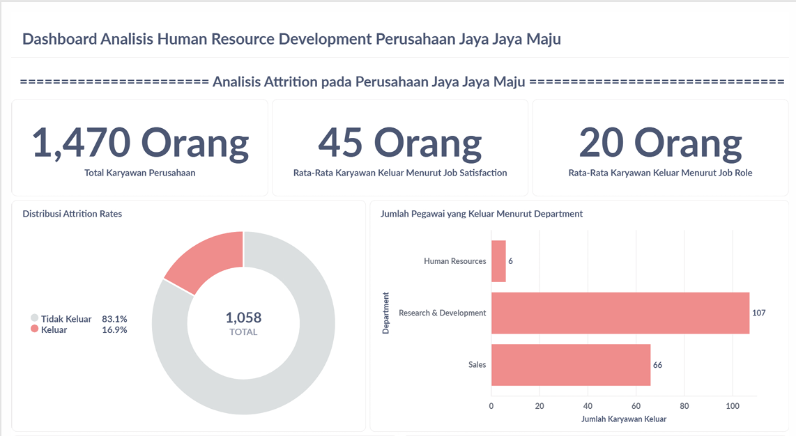

# Proyek Akhir: Menyelesaikan Permasalahan Perusahaan Edutech

## Business Understanding

Perusahaan multinasional Jaya Jaya Maju telah beroperasi sejak tahun 2000 dan kini memiliki lebih dari 1000 karyawan yang tersebar di berbagai wilayah Indonesia. Meski telah tumbuh menjadi perusahaan besar, Jaya Jaya Maju menghadapi tantangan serius dalam pengelolaan sumber daya manusia. Salah satu konsekuensinya adalah tingkat attrition yang tinggi, di mana lebih dari 10% karyawan memilih untuk meninggalkan perusahaan.

### Permasalahan Bisnis

Jaya Jaya Maju merupakan perusahaan multinasional yang telah beroperasi sejak tahun 2000 dan kini mempekerjakan lebih dari 1000 karyawan yang tersebar di berbagai wilayah Indonesia. Meskipun telah berkembang menjadi perusahaan berskala besar, Jaya Jaya Maju menghadapi tantangan serius dalam pengelolaan sumber daya manusia. Salah satu permasalahan utama yang muncul adalah tingginya tingkat attrition, di mana lebih dari 10% karyawan memilih untuk mengundurkan diri dari perusahaan.
Tingginya attrition rate ini menjadi indikator bahwa jumlah karyawan yang meninggalkan perusahaan secara sukarela jauh lebih tinggi dibandingkan dengan yang bertahan. Kondisi ini memberikan dampak signifikan terhadap stabilitas operasional, terutama karena kepergian karyawan dapat mengganggu alur kerja, menyebabkan keterlambatan dalam penyelesaian tugas, dan meningkatkan beban kerja bagi karyawan yang tersisa. Jika terus dibiarkan, situasi ini berpotensi menurunkan produktivitas secara keseluruhan dan memicu penurunan efisiensi dalam jangka panjang.
Untuk mengatasi tantangan ini, perusahaan perlu melakukan analisis menyeluruh terhadap faktor-faktor yang menyebabkan tingginya angka attrition. Faktor-faktor tersebut bisa berasal dari aspek internal perusahaan, seperti beban kerja yang tinggi, fasilitas kerja yang kurang memadai, serta rendahnya tingkat kepuasan dan keterlibatan karyawan. Di sisi lain, aspek eksternal seperti latar belakang pribadi karyawan juga dapat memengaruhi keputusan untuk keluar dari perusahaan. Dengan mengidentifikasi dan memantau faktor-faktor tersebut secara cermat, perusahaan dapat merancang strategi retensi yang lebih tepat sasaran, sehingga mampu menekan tingkat attrition dan menjaga keberlanjutan operasional secara optimal.

### Cakupan Proyek

- Preprocessing data untuk memperoleh data yang clean hingga dapat dianalisis.
- Analisis berupa Eksplorasi Data dengan memperoleh faktor yang mempengaruhi Attrition Rates meningkat di perusahaan
- Membuat Dashboard yang menunjukkan nilai Attrition Rates berdasarkan data pegawai.
- Mengembangkan model machine learning untuk mengidentifikasi kerentanan pegawai untuk Keluar dari perusahaan berdasarkan variabel penyusunnya.

### Persiapan

Sumber data: [Dataset Employee Perusahaan Jaya Jaya Maju](https://github.com/dicodingacademy/dicoding_dataset/tree/main/employee)

1. Setup environment:
```bash
# Clone repository
git clone https://github.com/anugerahsurya/BusinessDashboardUsingMetabase.git

# Masuk ke folder project
cd BusinessDashboardUsingMetabase

# Buat dan aktifkan virtual environment
python -m venv venv
source venv/bin/activate  # Gunakan ini untuk Linux/macOS
# venv\Scripts\activate   # Gunakan ini untuk Windows

# Install dependencies
pip install -r requirements.txt
```

2. Penggunaan Model Prediksi
```bash
# 1. Clone repository:
Pastikan Anda sudah meng-clone repository ini dan memastikan bahwa file berikut ada pada folder tersebut.
.
├── Encoder Tersimpan/
│   ├── BusinessTravel_encoder.pkl
│   ├── Department_encoder.pkl
│   ├── EducationField_encoder.pkl
│   ├── Gender_encoder.pkl
│   ├── JobRole_encoder.pkl
│   ├── kolomfit_attrition.pkl
│   ├── MaritalStatus_encoder.pkl
│   ├── minmax_scaler.pkl
│   └── OverTime_encoder.pkl
├── Model Tersimpan/
│   └── Model_Terbaik.pkl
├── datainput.xlsx
└── prediksiAttrition.py

# 2. Persiapkan Data untuk Prediksi:
Data yang ingin Anda prediksi dapat diinput pada file datainput.xlsx pada kolom yang bersesuaian. Usahakan input sesuai dengan nilai yang menjadi domain untuk kolom terkait.

# 4. Buka Terminal:
Buka terminal pada direktori yang sama dengan tempat Anda meng-clone repository ini.

# 5. Jalankan Proses Prediksi:
Ketikkan perintah berikut pada terminal untuk menjalankan proses prediksi:
     $ python prediksiAttrition.py
```

3. Setup Dashboard Metabase
```bash
# 1. Menarik (Pull) Gambar Docker Metabase
$ docker pull metabase/metabase:v0.46.4

# 2. Menjalankan Container Metabase
$ docker run -p 3000:3000 --name submissionpds1 metabase/metabase

# 3. Setelah Metabase berjalan, buka browser dan akses:
http://localhost:3000

# 4. Login menggunakan username dan password yang telah disediakan:
$ Username: root@mail.com
$ Password: root123
```
## Business Dashboard

<div style="text-align: center;">
  
  <p><b>Gambar 1. Preview 1 Dashboard Business HRD</b></p>
</div>

<div style="text-align: center;">
  
  <p><b>Gambar 2. Preview 2 Dashboard Business HRD</b></p>
</div>

   Gambar 1 dan Gambar 2 menunjukkan tampilan dari Dashboard Business yang dibangun sebagai penunjang dalam evaluasi Human Resource pada Perusahaan Jaya Jaya Maju. Dashboard dibangun menggunakan Metabase, di mana dashboard dirancang agar dapat interaktif sehingga dapat meningkatkan pengalaman pengguna saat mengeksplorasi dashboard serta dapat memberikan kemudahan bagi pengguna dalam memahami data yang disajikan. Terdapat 2 bagian pada dashboard yang dipilah berdasarkan jenis elemennya, yaitu visualisasi berupa angka langsung serta visualisasi berupa grafik. Pada Dashboard yang dibangun, juga diberikan penegasan terkait konteks yang dibahas yaitu Attrition Rates menurut faktor-faktor yang mempengaruhinya. Hal ini diharapkan dapat menjadi dasar untuk meningkatkan kemampuan perusahaan untuk mempertahankan karyawannya.

1. Kondisi Attrition dalam Angka
<div style="text-align: center;">
  
  <p><b>Gambar 3. Ringkasan Statistik Menurut Faktor Attrition</b></p>
</div>

   Gambar 3 menunjukkan ringkasan statistik berupa jumlah dan rata-rata dari komponen yang berkaitan dengan Attrition. Terlihat bahwa pada data yang diberikan terdapat 1470 karyawan di perusahaan tersebut. Diperoleh juga bahwa secara rata-rata pada setiap kategori Job Satisfaction, jumlah karyawan yang keluar sebanyak 45 orang. Hal ini menunjukkan walaupun rasio terhadap total karyawan tidak begitu besar, tapi angka ini menunjukkan kondisi yang kurang bagus, karena kondisi yang diinginkan seharusnya rataannya mendekati 0, sehingga dapat disimpulkan bahwa kepuasan atas pekerjaan mereka tidak mempengaruhi mereka untuk keluar dari perusahaan. 
   Selain itu, rataan juga diukur untuk setiap Job Role di perusahaan tersebut. Diperoleh bahwa secara rata-rata 20 karyawan keluar untuk setiap job role. Kondisi ini dapat menjadi gambaran awal yang menunjukkan bahwa tingkat ingin keluarnya karyawan berdasarkan job role mereka. Untuk mempertegas hal tersebut juga akan ditampilkan visualisasi pendukung seperti pada Gambar 4.

2. Distribusi Label Attrition Rates
<div style="text-align: center;">
  
  <p><b>Gambar 4. Proporsi Label Attrition Rates</b></p>
</div>

   Berdasarkan Gambar 4 dilakukan visualisasi untuk proporsi masing-masing kategori pada Attrition, di mana terdapat kategori karyawan Keluar dan Tidak Keluar. Terlihat bahwa dari 1058 total karyawan dengan keterangan Attritionnya, sebanyak 16,9% dari total karyawan memilih untuk keluar dari perusahaan. Hal ini mendukung penjelasan pada Gambar 4 dimana nilai ini cukup besar yang berujung pada pengurangan karyawan sehingga dapat berpengaruh terhadap penurunan performa perusahaan.

3. Distribusi Karyawan Keluar Menurut Department
<div style="text-align: center;">
  
  <p><b>Gambar 5. Proporsi Label Attrition Rates</b></p>
</div>

   Berdasarkan Gambar 5 terlihat bahwa jumlah karyawan keluar didominasi dari Department **Research & Development**. Hal ini mengindikasikan terdapat kondisi yang menyebabkan tingginya attrition di department tersebut. Hal ini dapat menjadi evaluasi bagi HRD untuk meninjau beberapa hal seperti beban kerja yang lebih, upah kerja yang kurang sesuai, atau hal-hal lain yang dapat menjadi faktor tingginya attrition di department tersebut.

4. Distribusi Karyawan Keluar Menurut Status Overtime
<div style="text-align: center;">
  
  <p><b>Gambar 6. Distribusi Karyawan Keluar Menurut Status Overtime</b></p>
</div>

   Gambar 6 menunjukkan distribusi karyawan keluar untuk setiap status Attrition menurut Status Overtime. Grafik tersebut menunjukkan bahwa karyawan yang tidak memilih untuk overtime cenderung untuk tidak keluar dan memilih untuk bertahan di perusahaan. Hal berbeda ditunjukkan oleh status overtime 'Yes', di mana karyawan yang memilih untuk Overtime memiliki kecenderungan bertahan yang lebih kecil. Hal ini mengindikasikan bahwa overtime dapat mengurangi kecenderungan karyawan untuk dapat bertahan di perusahaan karena rasio antara bertahan dan keluar semakin besar, sehingga jumlah karyawan bertahan mendekati karyawan yang ingin keluar. 

5. Distribusi Karyawan Keluar Menurut Job Role
<div style="text-align: center;">
  
  <p><b>Gambar 7. Distribusi Karyawan Keluar Menurut Job Role</b></p>
</div>

   Dalam meninjau role yang memberikan kecenderungan karyawan untuk keluar, dibentuk visualisasi menggunakan Bar Chart yang menambahkan line yang menyatakan batas (threshold) tertentu, di mana dipilih menggunakan nilai rata-rata. Gambar 7 menunjukkan bahwa terdapat 4 job role yang memiliki jumlah karyawan keluar di atas rata-rata masing-masing job role, yaitu Laboratory Technician, Salex Executive, Research Scientist, dan Sales Representative. Hal ini menunjukkan bahwa kecenderungan yang lebih tinggi dibanding role lainnya untuk karyawannya keluar, sehingga dapat ditinjau ulang agar bisa dievaluasi untuk meminimumkan efek dari job role terhadap attrition rates perusahaan.

6. Distribusi Attrition Rates Menurut Business Travel
<div style="text-align: center;">
  
  <p><b>Gambar 8. Distribusi Attrition Rates Menurut Business Travel</b></p>
</div>

   Dalam meninjau distribusi masing-masing kategori attrition berdasarkan Business Travel, dibentuk area chart untuk menunjukkan ketimpangan serta tren yang dibentuk pada masing-masing kategori. Kategori Business Travel merupakan variabel berurutan yang bertipe ordinal. Dari grafik tersebut, terlihat bahwa sebagian besar karyawan berada dalam kategori Travel_Rarely, yang juga mencatat jumlah karyawan keluar tertinggi secara absolut. Namun, hal ini belum tentu menunjukkan tingkat attrition yang tinggi, karena jumlah total karyawan dalam kategori ini memang dominan. Sebaliknya, kategori Non-Travel menunjukkan jumlah karyawan keluar yang sangat kecil, yang mengindikasikan bahwa karyawan yang tidak melakukan perjalanan dinas cenderung lebih stabil dan jarang mengundurkan diri dari perusahaan.
   Kategori Travel_Frequently memiliki jumlah karyawan yang lebih sedikit dibanding dua kategori lainnya, tetapi jumlah karyawan yang keluar terlihat cukup tinggi secara proporsional. Ini dapat mengindikasikan bahwa frekuensi perjalanan dinas yang tinggi dapat berdampak positif terhadap kecenderungan keluar karyawan, kemungkinan disebabkan oleh kelelahan, stres kerja, atau kurangnya keseimbangan antara pekerjaan dan kehidupan pribadi.

## Conclusion

Perusahaan Jaya Jaya Maju saat ini menghadapi masalah serius terkait tingginya tingkat attrition, dengan lebih dari 10% karyawan memilih keluar dari perusahaan. Berdasarkan visualisasi dashboard yang telah dikembangkan, ditemukan beberapa faktor signifikan yang berkontribusi terhadap tingginya attrition rates:

1. Karyawan yang sering melakukan lembur (overtime) memiliki kecenderungan lebih tinggi untuk keluar dari perusahaan, kemungkinan karena kelelahan kerja dan rendahnya work-life balance.

2. Beberapa posisi seperti Laboratory Technician, Sales Executive, Research Scientist, dan Sales Representative mencatat jumlah attrition di atas rata-rata, menunjukkan bahwa beban kerja atau kepuasan kerja pada posisi tersebut mungkin lebih rendah.

3. Departemen Research & Development menyumbang proporsi tertinggi terhadap karyawan yang keluar, menandakan adanya potensi permasalahan struktural, manajerial, atau beban kerja di departemen tersebut.

4. Karyawan dengan frekuensi perjalanan tinggi (Travel_Frequently) menunjukkan tingkat keluar yang tinggi secara proporsional. Sementara itu, karyawan yang tidak melakukan perjalanan dinas (Non-Travel) cenderung bertahan lebih lama.

### Rekomendasi Action Items

Untuk mengurangi tingkat attrition dan meningkatkan retensi karyawan, perusahaan disarankan untuk melakukan tindakan-tindakan berikut:

1. **Audit Beban Kerja dan Overtime**

   Lakukan evaluasi terhadap jam kerja dan beban tugas terutama di posisi dan departemen dengan attrition tinggi. Terapkan kebijakan **batas maksimum overtime** dan dorong manajemen waktu yang sehat. Sediakan **kompensasi lembur yang adil** dan program pemulihan seperti cuti tambahan atau hari kerja fleksibel.

2. **Peninjauan Ulang Struktur dan Lingkungan Kerja di R&D**

   Lakukan survei internal terhadap karyawan di **Research & Development** untuk mengetahui penyebab tingginya attrition. Perbaiki sistem kerja, jalur karier, dan komunikasi manajemen di departemen tersebut.

3. **Rotasi Job Role dan Career Path Development**

   Untuk posisi seperti **Sales Executive dan Laboratory Technician**, evaluasi beban kerja, target, dan sistem reward yang ada. Sediakan **pelatihan keterampilan tambahan** dan kesempatan rotasi antar divisi untuk mengurangi kejenuhan.

4. **Evaluasi Kebijakan Perjalanan Dinas**

   Kurangi frekuensi perjalanan dinas bagi karyawan di kategori **Travel\_Frequently** bila memungkinkan, atau berikan insentif dan dukungan (seperti kompensasi waktu istirahat atau tunjangan). Sediakan opsi kerja jarak jauh jika memungkinkan untuk mengurangi beban fisik akibat perjalanan.

Dengan mengadopsi pendekatan yang berbasis data seperti ini, perusahaan dapat mengidentifikasi akar masalah lebih cepat dan merancang strategi retensi yang lebih efektif dan tepat sasaran, sehingga menjaga stabilitas dan produktivitas jangka panjang perusahaan.

